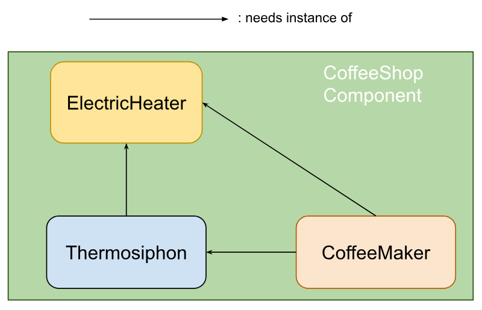
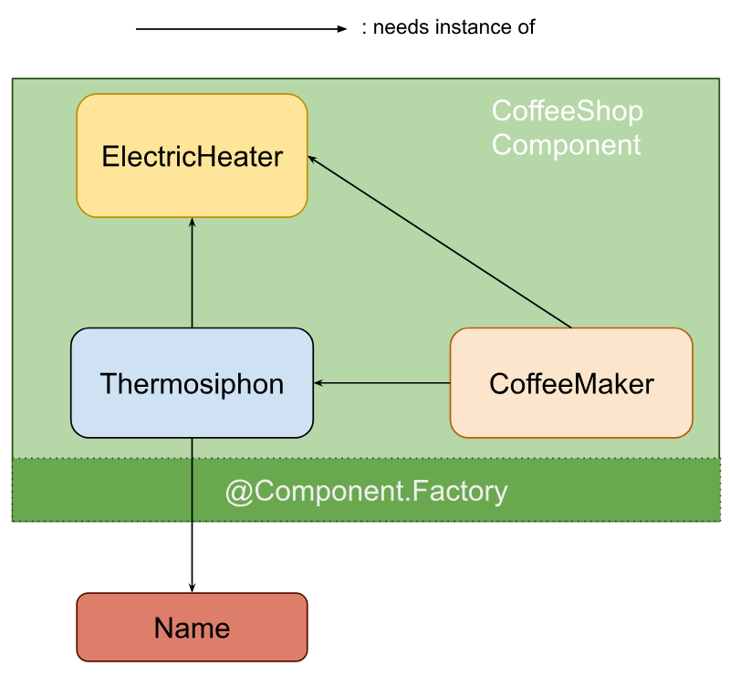
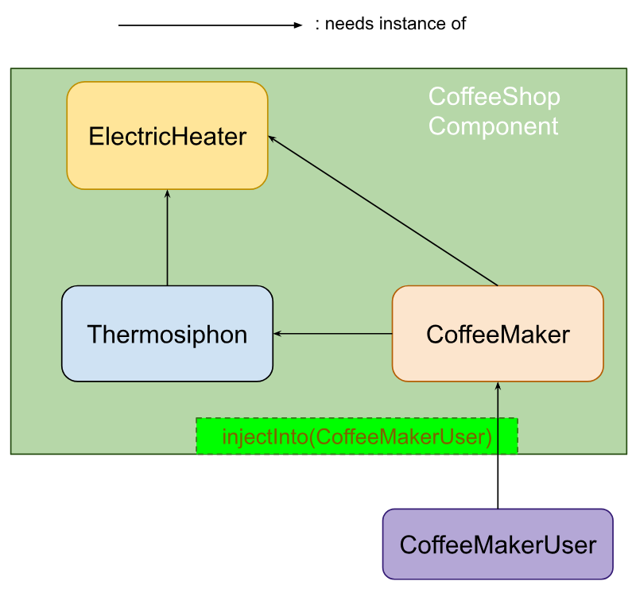
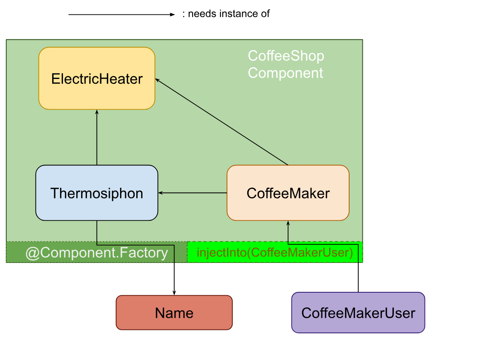

# Dependency injection with Dagger 2 - Part 2: injecting into and from objects not managed by Dagger

Dagger is pretty straightforward when injecting objects in its dependency graph. However, there are situations where Dagger does own the lifecycle of objects. In this post, we will explore some possibilities of interacting with objects whose lifecycle is not managed by dagger.

## The starter project

We will start by a Kotlin console application that defined the following graph using Dagger.



The starter project is available [here](https://github.com/yostane/dagger2_android_tutorial/tree/master/dagger-console-inject).

Let's dive into our main subjects.

## Injecting an external object to Dagger

Suppose we want to add a `name` property to the `Thermosiphon` class and set its value at runtime, for example from the program arguments. We may think of two possibilities:

- Get a `thermosiphon` instance using Dagger and then set the value of the `name` property.
- Set the name property as a constructor parameter and inject it while the component gets created.

The first solution can be achieved as follows:

```kotlin
class Thermosiphon @Inject constructor(private val heater: ElectricHeater) {
    var name = ""
    // other code
}
fun main(args: Array<String>) {
    val coffeeShop = DaggerCoffeeShop.create() // create() is a shortcut to builder().build()
    coffeeShop.coffeeMaker.pump.name = "My awesome siphon"
    coffeeShop.coffeeMaker.brew()
}
```

This solution is very simple to implement but it sets the property after object instantiation. It has the inconvenient of setting the property after the object has been instantiated. Thus, a cleaner alternative is to set the name property in the constructor.
This is done by adding the `name` parameter in the constructor of `Thermosiphon` and modifying the component so that that it accepts the `name` parameter as input.
This way, Dagger can bind the `name` provided to the component to the `name` constructor parameter of the `Thermosiphon`.

Dagger offers many possibilities for providing input data to a component.
The recommended way since version 2.22 of Dagger is to use `@Component.Factory` on an interface that serves as factory for the component.
This interface should define a method that returns an instance of the component and can take as many input parameters as needed. Each parameter must have a `@BindsInstance` annotation so that Dagger can include it in its dependency tree. This can be illustrated as follows.



In our case, we weed to pass a `name` parameter to the factory as illustrated by the following component code:

```kotlin
@Component.Factory interface Factory{
    fun create(@BindsInstance name: String): CoffeeShop
}
```

We usually define the factory as an inner interface of the component.
The following code snippet shows the new `Thermosiphon` constructor as well as the our new component with the newly created factory.

```kotlin
@Reusable class Thermosiphon @Inject constructor(private val heater: ElectricHeater, val name: String) {
    //other code
}

@Component
interface CoffeeShop {
    val coffeeMaker: CoffeeMaker
    // Allows to return a new component instance
    @Component.Factory
    interface Factory{
        // Declaration of a 'create' method with custom parameters
        // The @BindsInstance allows Dagger to inject this instance in its dependecy tree
        // The method should return an instance of the component
        fun create(@BindsInstance name: String): CoffeeShop
    }
}
```

## Injecting a Dagger managed object into a non Dagger managed one

In this part, we investigate the other way around.
In other words, we will inject objects managed by Dagger into objects that are not in the Dagger dependency tree.
This situation happens when we use libraries that do not let the developer instantiate their objects. In the following, we will learn how to do it with an example.

Suppose that we have a class named `CoffeeMakerUser` that requires an instance of a `CoffeeMaker` and the following two constraints: we cannot define a custom constructor (no constructor injection) and we cannot insatiate it in a module.
Taking these constraints into account, we can inject a `CoffeeMaker` into a `CoffeeMakerUser` by adding a method in the component that takes a `CoffeeMakerUser` as parameter. 
By calling this method after instantiating the component, Dagger automatically injects a `CoffeeMaker` from its graph into the `CoffeeMakerUser`.
This technique is illustrated as follows.



 The following steps show how to implement it.

- Add `@Inject` to the `CoffeeMakerUser` class.

```kotlin
class CoffeeMakerUser {
    @Inject lateinit var coffeeMaker: CoffeeMaker
}
```

- In the component add a function that takes a `CoffeeMakerUser` parameter. This function makes Dagger capable of injecting a `CoffeeMaker` from its dependency tree into a `CoffeeMakerUser`.

@Component interface CoffeeShop {
    val coffeeMaker: CoffeeMaker

    // allows to inject object from Dagger graph to another object not in the dependy graph
    fun injectInto(coffeeMakerUser: CoffeeMakerUser)
}

- After creating the component, call the the injection function by passing it the an instance of `CoffeeMakerUser`.

```kotlin
val coffeeShop = DaggerCoffeeShop.factory().create()
val coffeeMakerUser = CoffeeMakerUser()
coffeeShop.injectInto(coffeeMakerUser) // Injects objects into the coffeeMakerUser
coffeeMakerUser.coffeeMaker.brew() // coffeeMakerUser can use the injected coffeeMaker
```

For example, Android `Activities` are instantiated by the Android SDK, thus Dagger cannot automatically inject into these objects.

We can go even further by combining the two techniques studies in this post as illustrated by the following figure.



## Conclusion

In addition to managing its own dependency tree, Dagger is capable of interacting with objects which are not part of it.
In this post, we have first seen how to use `@Component.Factory` to inject external object into a Dagger component. After that, we have seen how to inject objects from a Dagger component into another object not managed by Dagger.

[Using Factory to inject external objects](https://github.com/yostane/dagger2_android_tutorial/tree/master/03-dagger-console-binds)

[Injecting into objects not managed by Dagger](https://github.com/yostane/dagger2_android_tutorial/tree/master/dagger-manual-inject)

## Links

[Dagger 2 on Android: the shiny new @Component.Factory](https://proandroiddev.com/dagger-and-the-shiny-new-component-factory-c2234fcae6b1)